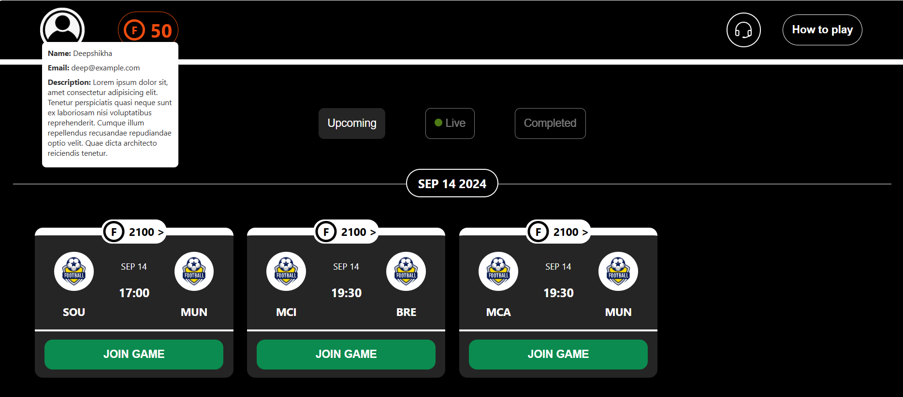
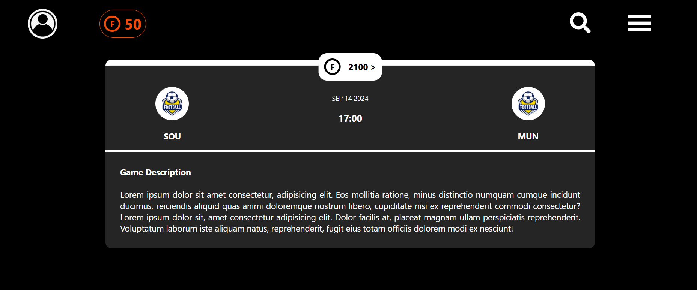
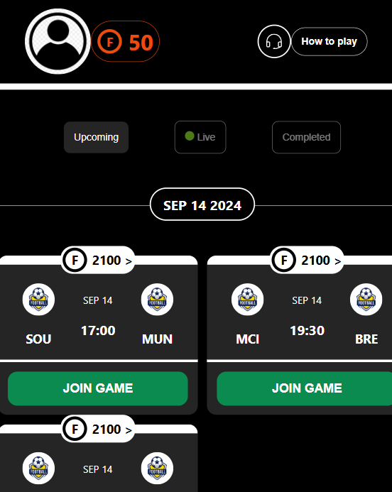
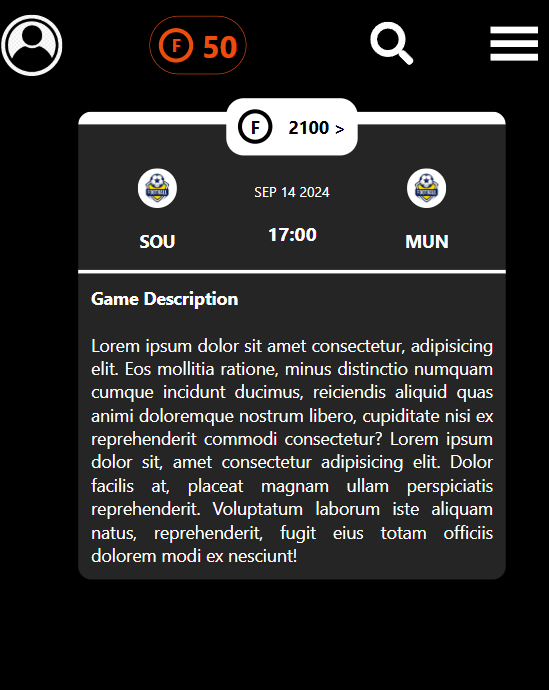

# Futy
A sports match application built with React. It displays a list of football matches with a user-friendly interface. The app also features a Navbar with a profile dropdown, coin display, and a play button to enhance the user experience. 

## Home

### Features
- Home page displays a list of football matches with a user-friendly interface.
- Matches are grouped and displayed by their respective dates.
- The Navbar and Footer hide/show based on the user's scroll state.
- A profile icon in the Navbar that toggles a dropdown menu with the user's profile.
- The Navbar includes a coin display showing the user's balance with a custom coin icon.
- The layout adapts for smaller screen sizes with flexible and responsive styling.

## SingleGame

### Features
- A search icon that toggles an input field for searching.
- A clickable profile image that shows a dropdown with user options.
- A hamburger menu that opens to display additional user-related options.
- Displays the match's details.
- Ensures that the layout works on both mobile and desktop screens.

## Mobile View

## Tech Stack
HTML | JavaScript | CSS | React | styled-components

## Deploy
- vercel link: https://futy-alpha.vercel.app/
